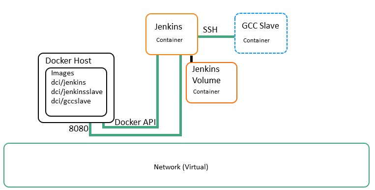

#   DockerCI
##  Project Status 30.07.2015
- First draft of DockerCI runs with **boot2docker on Windows**
- Docker Host API is currently not secured (Jenkins requires API access)
    * boot2docker on Windows secures the API by default, has to be disabled for first draft
- Building the [jenkinsTrial](https://github.com/icebear8/jenkinsTrial) for Linux is possible
    * git hub
    * python
    * g++
- Dockerfiles are available for
    * Jenkins
    * Jenkins Volume
    * Jenkins Slave
    * GCC Slave
- [Backlog](doc/Tasks.md)
    
**References**

[DockerCI, one step by another](doc/Setup.md)

#   Overview
DockerCI realizes a continuous integration build system with Docker and Jenkins.
The Jenkins master runs in a docker container.
For each build job, a Jenkins slave runs in its own container.
Each tool chain is managed in its own docker image.
The DockerCI creates and manages its tool chain images with docker files.

DockerCI has the vision to be used on the server as also on the local development machine.
The corresponding tool chain container could be used from the IDE to build (and run?) the source code.

##  DockerCI Advantages
### Separation of Tool Chains
Every tool chain has its own container (virtual context) and runs independent from other containers.
The installation of a new tool chain does not affect the current tool chains or the Jenkins server.
DockerCI is able to support all kind of tool chain in any version at the same time.

### Minimize Idle Resources
In DockerCI the Jenkins slaves are only active when there is a job running for their tool chain.
They are not active (even not in idle mode), when they are not used.
An idle DockerCI Jenkins slave only uses disk space.
And even the used disk space is optimized due to Dockers union file system.

### Tool Chain Versions
For every tool chain a Docker image is created from a Docker file.
The Dockerfiles are managed by a version control system (git).
With a properly written Dockerfile any version of a specific image can be recovered at any time.

Also Docker it self provides a mechanism to tag and specify image versions.
As long as the images are on the Docker host or if they are pushed to the Docker Hub Registry,
the tags can be used to recover a previous image version.

### Application Updates
To update an application in DockerCI, the image of the corresponding container must be updated.
The current container and the container from the updated image can concurrently run on the Docker Host.
This means that an application update can be tested before the old container is replaced by the updated container.
If the updated application container does not behave as expected, a roll back to the previous version can be done.

### Simple Distribution of the Development Environment
If parts of DockerCI could also be used on the development machine the developer
would use the same environment as the build server.
This means local builds would no more be affected by local installations (e.g. new version of a specific library).

The tool chain update could be provided in the same way as for the build server.

## Architecture

### Docker Host
The docker host is a Linux distribution with Docker installed.

####  Docker Images
The host contains the docker images from which a container can be created and started.
A local registry manages the image access.
The Docker deamon is used to build, create, start and stop these images.

####  Docker API
Docker provides a REST API to interact with the Docker deamon.
This API is used by the Jenkins Docker plug in to run the Jenkins slave containers.
Docker provides the ability to secure Docker API access with certificates, which is strongly recommended!

### Jenkins (Master)
The Jenkins (Master) is the main entry point for DockerCI.
He manages the Jenkins slaves and defines the available build jobs.

####  Create Docker Images
Jenkins could not only be used to build sources but also to build Docker images.
This would lead into a system that builds and updates its all tool chains.

####  Docker plug in
The Docker plug in allows Jenkins to run slaves in Docker containers.
The plug in requires a Docker image with Java and an SSH server installed.
For every build job a Docker container is created from the specified image.
After the container finished his job he is terminated.

####  Jenkins Volume
Persistent data should be separated from the running application.
This approach simplifies backup, restore and update scenarios.
For this reason a data only container is created and mounted in the Jenkins (Master) application container.

### Jenkins Slaves
A Jenkins slave must provide Java and an SSH server.
In DockerCI a slave has also Python installed to simplify the build steps.
When Jenkins (Master) is triggered to build a repository he first starts the corresponding Docker tool chain container.
Afterwards he sends the Jenkins slave binary and the build information to the Docker container.
The Docker slave container starts the Jenkins slave which executes the appropriate build actions.

##  Project Repository Recommendations
### Keep Build Jobs Simple and Minimalistic
A build job in Jenkins is stored as an xml file in the Jenkins file system
(located at `/var/jenkins_home/jobs/{JOB}/config.xml`).
These files are **NOT** under version control.
Of course it is possible to stored with a backup strategy.
But they have to be saved every time they change.
And the recovery scenario to reproduce a several years old build is horrible.

A better approach is to let the source control system take care about the build script.
Currently the minimalistic approach is that the DockerCI job executes the Python script
located at `scripts/build.py`.
As long as this behavior is not changed all projects can be built with the same build job.

##  Images and Layering
Base image is Debian Jessie.

### dci/jenkins
The Jenkins (master) image is dependent from the base Debian image and installs:

- JRE
- Jenkins
- Creates user 'jenkins'

Installed Jenkins plug ins:

- Docker plug in
- Git

### dci/voljenkins
This image is used to create a data only container which holds the Jenkins working directory.
Currently it depends on the dci/jenkins image but maybe this dependency will may be eliminated
and the volume will be dependent from the Debian base image.

### dci/jenkinsslave
The image of a generic slave depends on the base Debian Jessie image and installs:

- JRE
- Python
- SSH server
- Creates user 'jenkins'

### dci/gccslave
Is based on dci/jenkinsslave and installs:

- g++

