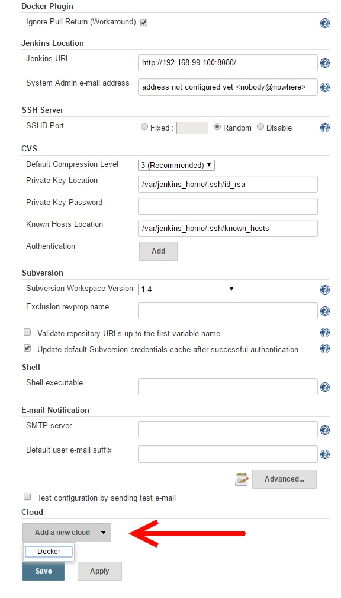
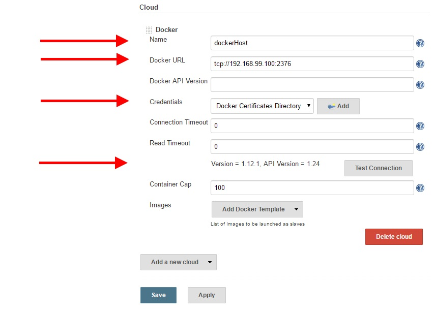
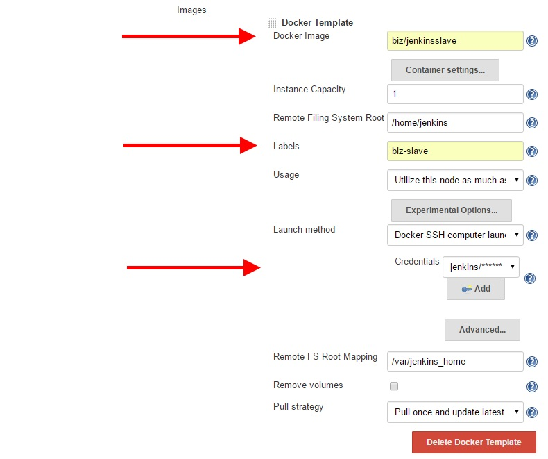
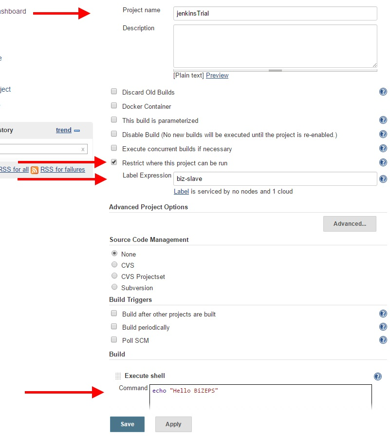
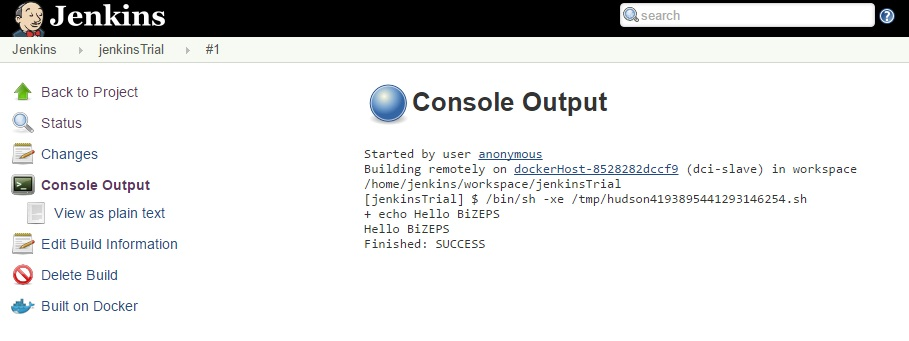

#   Quick Start Guide
BiZEPS is based on Docker with its containers and images.
This guide does not bother you with the details of how
Docker and BiZEPS are working together.
No, this guide will tell you how to run BiZEPS within an hour.

##  Setup Docker
The hardest part of this guide:
Make sure that you have a running docker environment.
Please install the required packages on your system.
Follow the [offical documentation](https://docs.docker.com/) for this step
- [Windows](https://docs.docker.com/windows/)
- [Linux](https://docs.docker.com/linux/)
- [Mac](https://docs.docker.com/mac/)

### Windows
If you have issues with starting the 'Docker Quickstart Terminal' you can try several things:
- Hyper-V must be deactivated if you want to use Docker and 'Oracle VM VirtualBox'
  - http://www.eightforums.com/tutorials/42041-hyper-v-enable-disable-windows-8-a.html
- Uninstall Docker and 'Oracle VM VirtualBox', restart your PC and reinstall Docker

##  Prepare BiZEPS
Once you have a Docker installation running, you have to clone the BiZEPS repository.

- Create a directory where you want to clone the project
  - `mkdir dev`
  - `cd dev`
- Clone the repository
  - `git clone https://github.com/Zuehlke/BiZEPS.git`
- Create the BiZEPS images
  - `cd BiZEPS/utils`
  - `./buildBiZEPS.sh`

##  Start Jenkins
As soon as the images are created you are able to start and use the Jenkins server.

- Start the Jenkins Server
  - `./jenkinsStart.sh`
- Check the IP of the Docker VM
  - The IP is printed out when the docker console starts
  - Or `docker-machine url` will print the IP address of the VM
- Connect to the started Jenkins with your web browser
  - For example `http://192.168.99.100:8080`

##  Prepare the Jenkins Docker Plug In
Once Jenkins is started, the Docker plug in can be configured.

### Add Docker Cloud
Click `Manage Jenkins` and then `Configure System`.
At the bottom of the configuration page click `Add a new cloud` and select `Docker`.

### Connection to Docker API
Give your Docker cloud a name and add the Docker URL `unix:///var/run/docker.sock`.
With `Test Connection` you can verify that the Docker plug in can communicate with the Docker API.

### Add a New Docker Template
At images click `Add Docker Template` and select `Docker Template`.
Write `dci/jenkinsslave` in the text box `Docker Image` and define the Label with `dci-slave`.
Add new Cridentials of the Kind `Username with password` and at `Global` scope.
Use `jenkins` as username and password.

##  Create a New Job
At the main page of Jenkins select `create new jobs`, select `Freesyle project` and think out a nice name.
On the next page make sure that `Restrict where this project can be run` is checked and
select `dci-slave` as `Label Expression`.
In the section `Build` click `Add build step`, select `Execute shell` and
write a test command into the text box.
For example `echo "Hello BiZEPS"`.

##  Enjoy
Save your job configuration and execute the build with `Build Now`.
After the job has finished you can verify the build output with the `Console Output`.
For a successful build it would display an output like this:

Contgratulation, you just executed a build job on a Jenkins slave.
The Jenkins slave and the master are running in separate Docker containers.
The slaves container is active only during the build.
