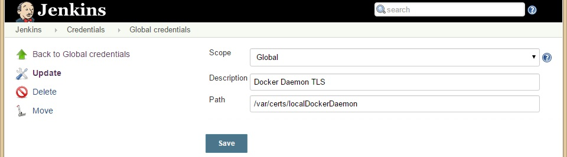

[prev: Docker Configuration](02_DockerConfiguration.md)

#   Jenkins Configuration
Configure the Jenkins to connect to the docker daemon, start and create containers and run a build job.

##  Initial Jenkins Startup
The Jenkins server instance can be started with a docker-compose script.
In the project space change to the directory `buildServer/jenkins` and execute the command `docker-compose up -d`.
Executing the `docker-compose` command will lead into the following actions:
- Uses the image `bizeps/jenkins:stable`
  - If the image is not available on the local host, it tries to pull the image from the docker hub
  - If the image is not available on docker hub, it tries to build the image with the information from the `Dockerfile`
- Uses a volume container for the Jenkins home directory
  - If a volume container is existing, it will be reused
  - Elsewise a new volume container will be created
- Starts the Jenkins server in a container
  - Container name is `bizJenkins`
  - Listening on port 8080
  - Starting in detached mode (parameter `-d`)

Connect to the Jenkins server with your browser. Use the IP of the host machine (e.g. `172.17.0.1:8080`).
If Jenkins is started for the first time, the basic setup and security configuration has to be executed.

##  Required Plugins
- [Docker Commons Plugin](https://wiki.jenkins-ci.org/display/JENKINS/Docker+Commons+Plugin)
- [Docker Pipeline Plugin](https://wiki.jenkins.io/display/JENKINS/Docker+Pipeline+Plugin)
  
##  Prepare Credentials
Check the credentials to access the docker daemon:
- Select `Credentials/Global credentials/Add Credentials`
  - Kind: `Docker Host Certificate Authentication`
  - Add the server and client certificate information (from the Docker host)
  - ID: `default-docker-host-credentials`
  - Description: `Credentials for the default docker host`



##  Prepare Docker Host Connection
Introduce a global environment variable to simplify the usage of the Docker host access (daemon REST API).
Click `Manage Jenkins` and then `Configure System`.
The section `Global properties` allows you to define a key value pair with the Docker host connection information.


##  Create a New Job
At the main page of Jenkins select `create new jobs`, select the project type `Pipeline` and think out a nice name.
Add a basic test script in the section `Pipeline`:

```
node {

  docker.withServer("${DEFAULT_DOCKER_HOST_CONNECTION}", 'default-docker-host-credentials') {
  
    stage('Clone Repository') {
      git branch: 'master', url: 'https://github.com/Zuehlke/BiZEPS.git'
    }
    
    stage ('Build Project') {
      docker.image('biz/gcc:latest').inside {
        echo 'Execute build'
      }
    }
    
    stage ('Execute test') {
      docker.image('biz/gcc:latest').inside {
        echo 'Execute test'
      }
    }
  }
}
```


In the section `Build` click `Add build step`, select `Execute shell` and
write a test command into the text box.
For example `echo "Hello BiZEPS"`.


##  Enjoy
Save your job configuration and execute the build with `Build Now`.
After the job has finished you can verify the build output with the `Console Output`.


For a successful build it would display an output like this:

```
Started by user doe
[Pipeline] node
Running on master in /var/jenkins_home/workspace/Test Pipeline
[Pipeline] {
[Pipeline] withDockerServer
[Pipeline] {
[Pipeline] stage
[Pipeline] { (Clone Repository)
[Pipeline] git
 > git rev-parse --is-inside-work-tree # timeout=10
Fetching changes from the remote Git repository
 > git config remote.origin.url https://github.com/Zuehlke/BiZEPS.git # timeout=10
Fetching upstream changes from https://github.com/Zuehlke/BiZEPS.git
 > git --version # timeout=10
 > git fetch --tags --progress https://github.com/Zuehlke/BiZEPS.git +refs/heads/*:refs/remotes/origin/*
 > git rev-parse refs/remotes/origin/master^{commit} # timeout=10
 > git rev-parse refs/remotes/origin/origin/master^{commit} # timeout=10
Checking out Revision a8830ce8d3d9f52f4c97249dced90ca72d2437bd (refs/remotes/origin/master)
Commit message: "Merge branch 'doe/docReferenceProject'"
 > git config core.sparsecheckout # timeout=10
 > git checkout -f a8830ce8d3d9f52f4c97249dced90ca72d2437bd
 > git branch -a -v --no-abbrev # timeout=10
 > git branch -D master # timeout=10
 > git checkout -b master a8830ce8d3d9f52f4c97249dced90ca72d2437bd
 > git rev-list a8830ce8d3d9f52f4c97249dced90ca72d2437bd # timeout=10
[Pipeline] }
[Pipeline] // stage
[Pipeline] stage
[Pipeline] { (Build Project)
[Pipeline] sh
[Test Pipeline] Running shell script
+ docker inspect -f . biz/gcc:latest
.
[Pipeline] withDockerContainer
Jenkins seems to be running inside container 2f25a04d393f04356f53d5696b498d11e28b91b296c4b754fa3b99767855bf39
$ docker run -t -d -u 1000:1000 -w "/var/jenkins_home/workspace/Test Pipeline" --volumes-from 2f25a04d393f04356f53d5696b498d11e28b91b296c4b754fa3b99767855bf39 -e ******** -e ******** -e ******** -e ******** -e ******** -e ******** -e ******** -e ******** -e ******** -e ******** -e ******** -e ******** -e ******** -e ******** -e ******** -e ******** -e ******** -e ******** -e ******** -e ******** -e ******** -e ******** -e ******** -e ******** -e ******** -e ******** --entrypoint cat biz/gcc:latest
[Pipeline] {
[Pipeline] echo
Execute build
[Pipeline] }
$ docker stop --time=1 d0010ec431605f15b806ad56449b7539ab76dbf93eb7d61651446c005d24523b
$ docker rm -f d0010ec431605f15b806ad56449b7539ab76dbf93eb7d61651446c005d24523b
[Pipeline] // withDockerContainer
[Pipeline] }
[Pipeline] // stage
[Pipeline] stage
[Pipeline] { (Execute test)
[Pipeline] sh
[Test Pipeline] Running shell script
+ docker inspect -f . biz/gcc:latest
.
[Pipeline] withDockerContainer
Jenkins seems to be running inside container 2f25a04d393f04356f53d5696b498d11e28b91b296c4b754fa3b99767855bf39
$ docker run -t -d -u 1000:1000 -w "/var/jenkins_home/workspace/Test Pipeline" --volumes-from 2f25a04d393f04356f53d5696b498d11e28b91b296c4b754fa3b99767855bf39 -e ******** -e ******** -e ******** -e ******** -e ******** -e ******** -e ******** -e ******** -e ******** -e ******** -e ******** -e ******** -e ******** -e ******** -e ******** -e ******** -e ******** -e ******** -e ******** -e ******** -e ******** -e ******** -e ******** -e ******** -e ******** -e ******** --entrypoint cat biz/gcc:latest
[Pipeline] {
[Pipeline] echo
Execute test
[Pipeline] }
$ docker stop --time=1 561d3b1728e6e65e7e6d47748c6d727072ebc2665134475785a704542aa79c48
$ docker rm -f 561d3b1728e6e65e7e6d47748c6d727072ebc2665134475785a704542aa79c48
[Pipeline] // withDockerContainer
[Pipeline] }
[Pipeline] // stage
[Pipeline] }
[Pipeline] // withDockerServer
[Pipeline] }
[Pipeline] // node
[Pipeline] End of Pipeline
Finished: SUCCESS
```

Contgratulation, you just executed a build job on a Jenkins within a container.
The Jenkins master and the toolchains are running in separate Docker containers.
The toolchain container is active only during the build.
